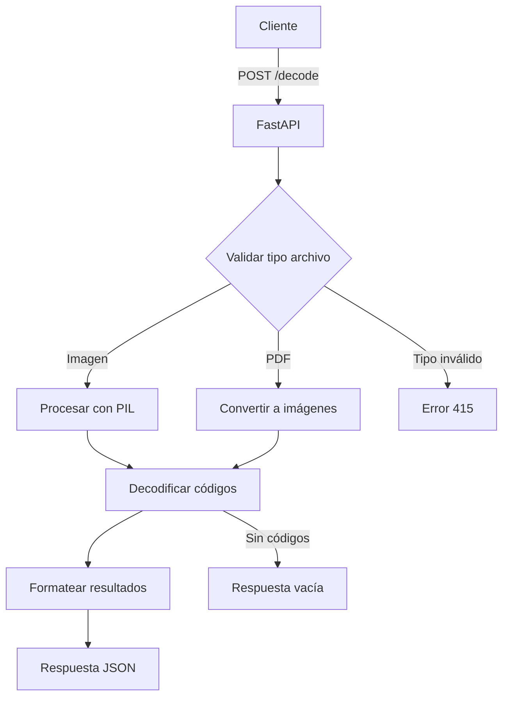

# Plan de Implementación - Lector de Códigos de Barras con FastAPI

## Objetivo
Crear un servicio REST que procese imágenes y PDFs para detectar códigos de barras usando pyzbar

## Dependencias Requeridas
```python
fastapi>=0.68.0
uvicorn>=0.15.0
python-multipart>=0.0.5
pdf2image>=1.16.0
pillow>=8.3.1
pyzbar>=0.1.9
```

## Arquitectura del Servicio


## Pasos de Implementación

1. **Configuración Inicial**
```bash
# Instalar dependencias del sistema
sudo apt-get install poppler-utils
```

2. **Estructura del Servicio (main.py)**
```python
from fastapi import FastAPI, File, UploadFile, HTTPException
from fastapi.responses import JSONResponse
from pdf2image import convert_from_bytes
from pyzbar.pyzbar import decode
from PIL import Image
import io

app = FastAPI()

@app.post("/decode/")
async def decode_barcodes(file: UploadFile = File(...)):
    # Lógica de procesamiento aquí
```

3. **Lógica Principal**
- Validar tipo MIME (image/* o application/pdf)
- Procesar PDFs con pdf2image
- Decodificar cada página/frame
- Formatear respuesta con tipos de código y datos

4. **Manejo de Errores**
```python
HTTPException(
    status_code=415,
    detail="Formato no soportado. Use: PNG, JPG, PDF"
)
```

5. **Ejemplo de Respuesta**
```json
{
    "filename": "test.pdf",
    "page_count": 3,
    "barcodes": [
        {
            "page": 1,
            "type": "CODE128",
            "data": "ABC123",
            "rect": [10, 20, 100, 50]
        }
    ]
}
```

## Consideraciones de Seguridad
- Limitar tamaño de archivos a 20MB
- Timeout de procesamiento: 30 segundos
- Validación estricta de tipos MIME